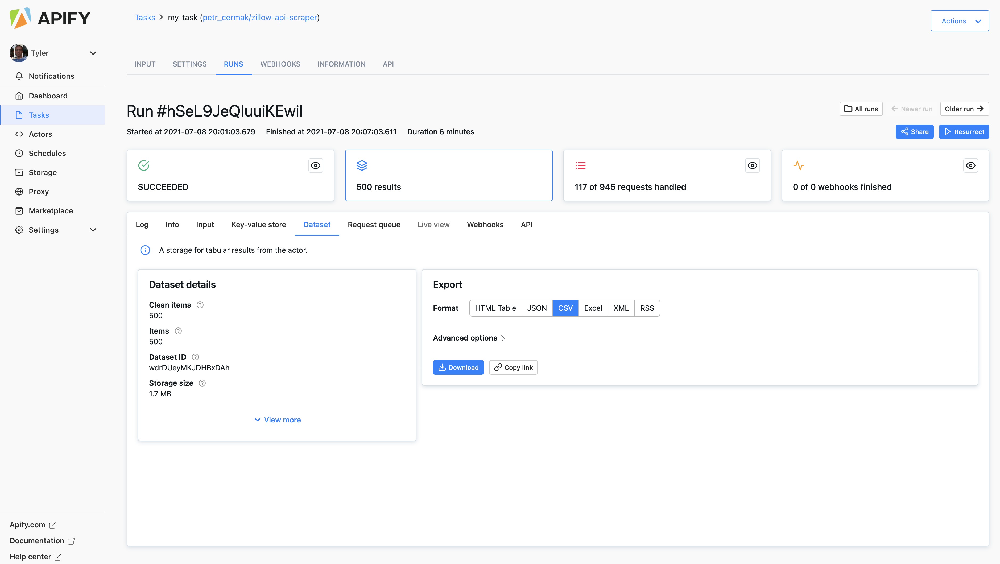

# Project 1

## Using the example script given in class, go to zillow and select several homes to train a model that predicts home price.  
- For reference watch [What is ML by Laurence Maroney](https://www.youtube.com/watch?v=_Z9TRANg4c0), beginning at about minute 8 with the subsequent housing price exercise presented at the end of the video.  You are also welcome to refer to the beginning part of the second video in this series [First steps in computer vision](https://www.youtube.com/watch?v=j-35y1M9rRU), where the solution to the example housing price exercise is presented.
- Got to the [Apify zillow scraper](https://my.apify.com/tasks/P272AlfQkMTlQnoHe#/input) and scrape a few hundred home sale listings from any city.  Download the file as a `.csv`.



- Use the pandas `read_csv()` function to import your file to your PyCharm session.  Create a data frame that has the following variables.
    - price
    - bedrooms
    - bathrooms
    - livingArea

- Check if your data frame has any NaN values and drop them in place as needed.

- As in the above referenced example, scale the living area and price values.  Check the shape of your input data in preparation for specifying your model.

- Pipe the data to your model as follows.

```
model = tf.keras.Sequential([keras.layers.Dense(units=1, input_shape=[3])])
model.compile(optimizer='sgd', loss='mean_squared_error')
history = model.fit(X, y, epochs=100)
```

- Use `model.predict()` to predict the price of each home using the input variables

- Inverse transform these values (the opposite of where you scaled the price above) and add them as a new column in your data frame.

- Use the following to plot model loss.

```
plt.plot(history.history['loss'], label='loss')
plt.ylim([add, add])
plt.xlim([add, add])
plt.xlabel('Epoch')
plt.ylabel('loss')
plt.legend()
plt.grid(True)
plt.show()
```

- Use the following to plot the asking price and predicted price for all of the homes in your selected city

```
plt.scatter(your_dataframe['add_variable'], your_dataframe['add_variable'])
plt.xlim([add, add])
plt.ylim([add, add])
plt.axline([0, 0], [1, 1])
plt.xlabel('add_label')
plt.ylabel('add_label')
plt.legend()
plt.show()
```

- Produce the MSE for your model using the following.

```
mse = np.mean((y - y_pred) ** 2)
mse
```

- Answer the following questions.

    - How did your model fare?
    - In your estimation is there a particular variable that may improve model performance?
    - Which of the predictions were the most accurate?  In which percentile do these most accurate predictions reside? Did your model trend towards over or under predicting home values?
    - Which feature appears to be the most significant predictor?

