## Tuesday

- **Download and install python 3.9.6**  
  The simplest way to install the latest version of python is by going to their website, [python.org](https://www.python.org/) and downloading the most recent version.  After arriving at the main python.org landing page you should find a tab linking to the download for Python 3.9.6.  Once there, download and install the latest version of python for your Mac or Windows system.
- **Download and install PyCharm Professional Version**  
  In this class we will use the integrated developer's environment (IDE), which goes by the name of PyCharm.  Go to the [jetbrains.org](https://www.jetbrains.com/pycharm/) website and download the Professional version for your Mac or Windows system.  After installing PyCharm, launch it from your applications folder.  You can use the *evaluate for free* button for now, until you obtain your JetBrains educational license.  
- **Set the python interpreter**  
  After launching PyCharm, select *new project*, and give your project a name (perhaps DATA310), and for the python interpreter, select *previously configured interpreter* and choose the `...` tab to the right of the interpreter drop down menu.  This tab will bring you to a new window, where you will want to select the *system interpreter* option on the left option bar.  Hopefully the option for *python3.9* already appears in the interpreter drop down menu.  If not, you will likely need to select the `...` tab to the right again, and manually select the python3.9 interpreter from within your file system.  On a Mac the path to the version of python you installed in step 1 is likely `/usr/local/bin/python3.9`.  Once your python 3.9.6 interpreter has been selected, then click on the *OK* button in the bottom right hand corner.

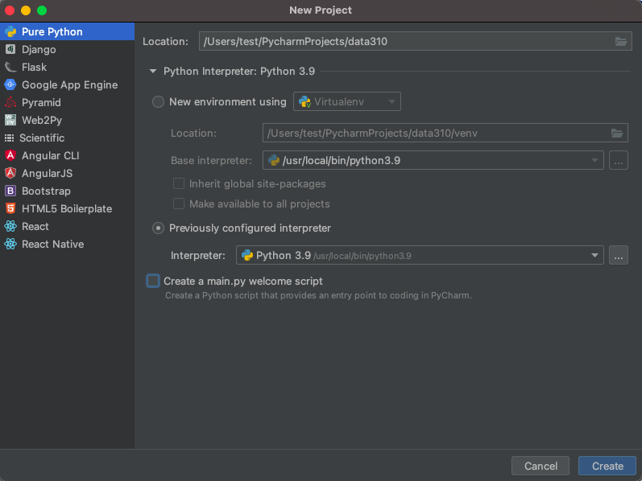
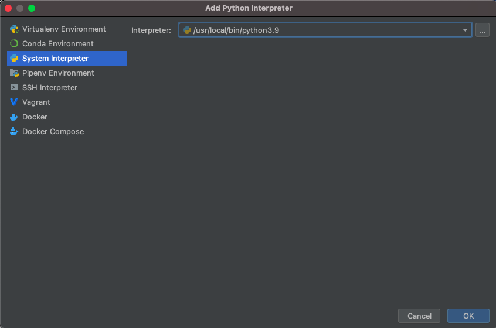
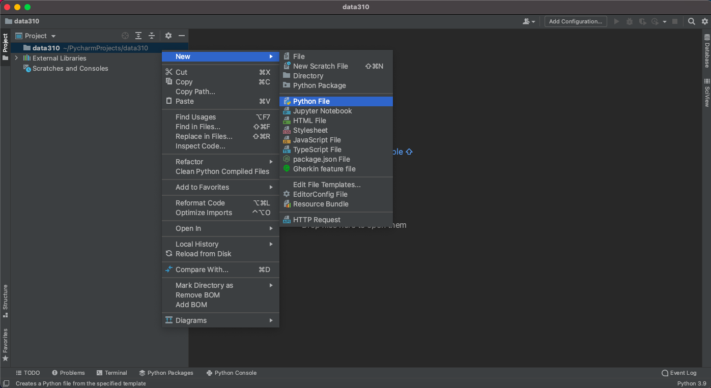

- Confirm your python session
  After creating a new script, click on the python console at the bottom of the screen and confirm your environment is using python 3.9.6.  In your new script, add a line where you send a command to the interpreter.
  
```
2 + 2
```

The easiest way to execute the line of code is to make sure the cursor os on that line and then use the *alt-shift-E* combination in order to send the command to the interpreter for a result.  Alternatively, you can option click (right click or two finger click) on the line and select the *execute line in python console* option.

If python returns the correct answer, then it appears you have properly configured your environment.

- Install a new package
  Your PyCharm IDE includes a package manager that makes package installation and updating fairly simple.  To install a new package click on the *preferences* tab under your PyCharm pull down menu and then select the *Project* tab.  Under the project tab you should see a subtab called *Python Interpreter* and off to the right, two packages that have already been installed.  First, make sure both of these packages (should be *pip* and *setuptools*) have the most up to date version installed, and if not, use the up arrow symbol to upgrade each package to its latest version.  Next select the *+* button to install a new package.  Type *tensorflow* in the search window and then select *install package*.  It might take a minute or two for the *tensorflow* package to complete its installation process.  You can monitor your IDE's progress at the bottom while waiting for tensorflow to be installed successfully.  After returning to main window of your package manager, you should notice a number of additional dependent packages that were installed in support of tensorflow.  Close the system preferences window and add a new line to your script `import tensorflow`.  Again, your IDE may take a minute or two in order to execute the command for the first time, but once complete, you should see the `>>>` indication that your interpreter is ready to execute a command.  If you click on the progress bar, it is possible to review the background tasks that involve updating the interpreter.  

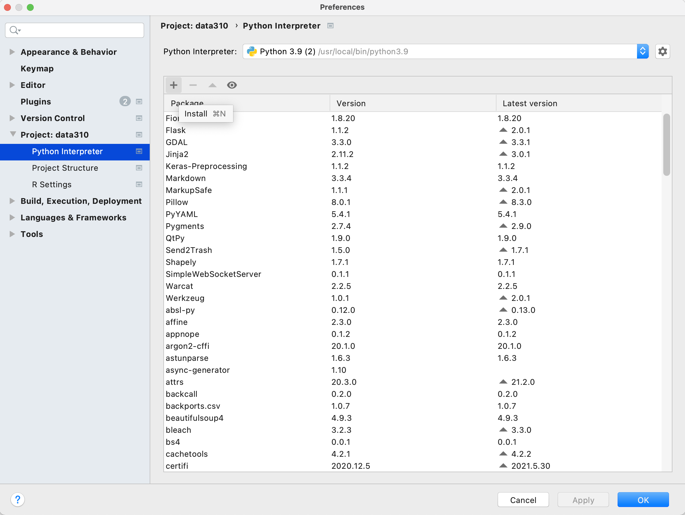

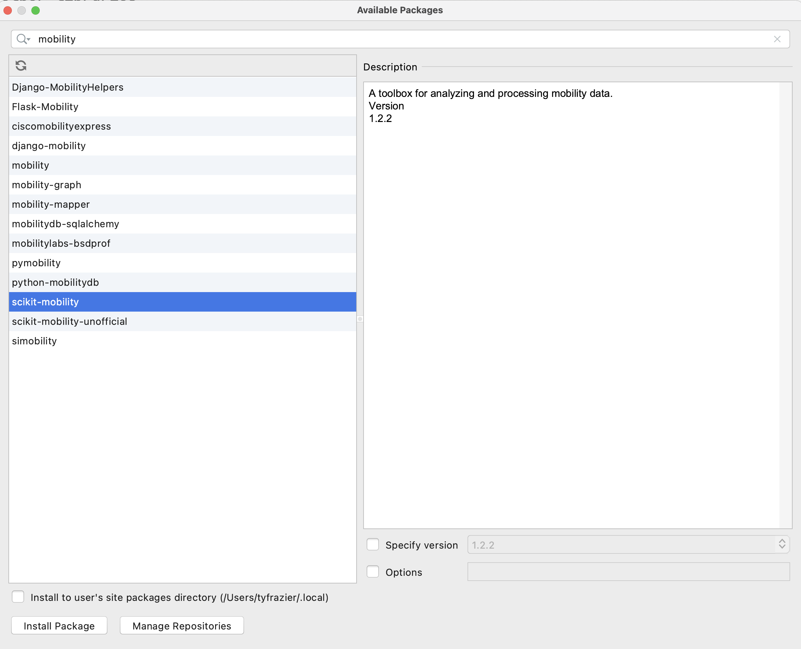

After the system finishes add a few lines to your script and confirm the output.
  
```
# TensorFlow and tf.keras
import tensorflow as tf

# Helper libraries
import numpy as np
import matplotlib.pyplot as plt

print(tf.__version__)
```
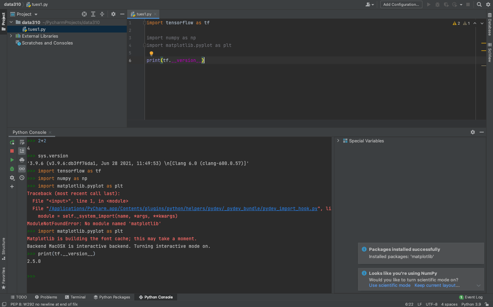

- Next go to the JetBrains webpage and register for an [educational license](https://www.jetbrains.com/shop/eform/students).  After receiving your license, return to the *Welcome to PyCharm* page and click on the gear symbol in the bottom left hand corner, where you will find the option to *manage licenses*.  Enter your license to register your Professional version of PyCharm.

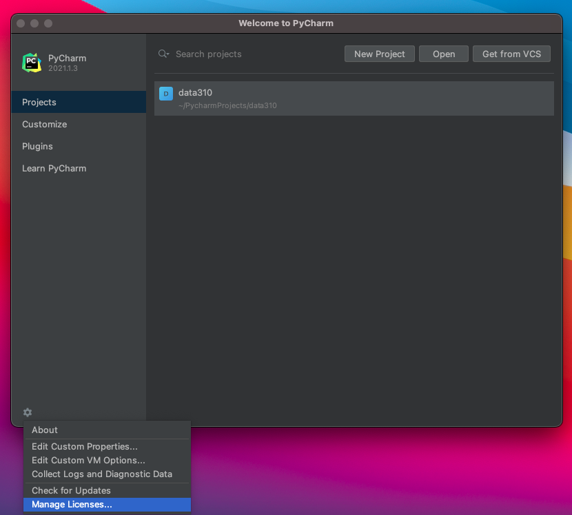

- Next install the JetBrains IDE [WebStorm](https://www.jetbrains.com/webstorm/) for interacting with your GitHub account.  Webstorm is a good IDE for producing markdown files for publishing in your public facing GitHub pages site.

- Next, if you don't already have one, create a [GitHub](https://github.com) account.  Once you have a GitHub account, create a new repository.  Perhaps call it *data310*.  Each repository needs to have a `README.md` file in its root directory.  Be sure to create one, which you can use as the index for your repository of formal and informal assignments.

- Go to the settings tab in your repository and click on the *pages* tab in the left hand pane.  Set the branch to main, save your GitHub pages and then note where your site has been published.  Click on the link and reload it, until it appears.  Sometimes this can take a minute or two.  

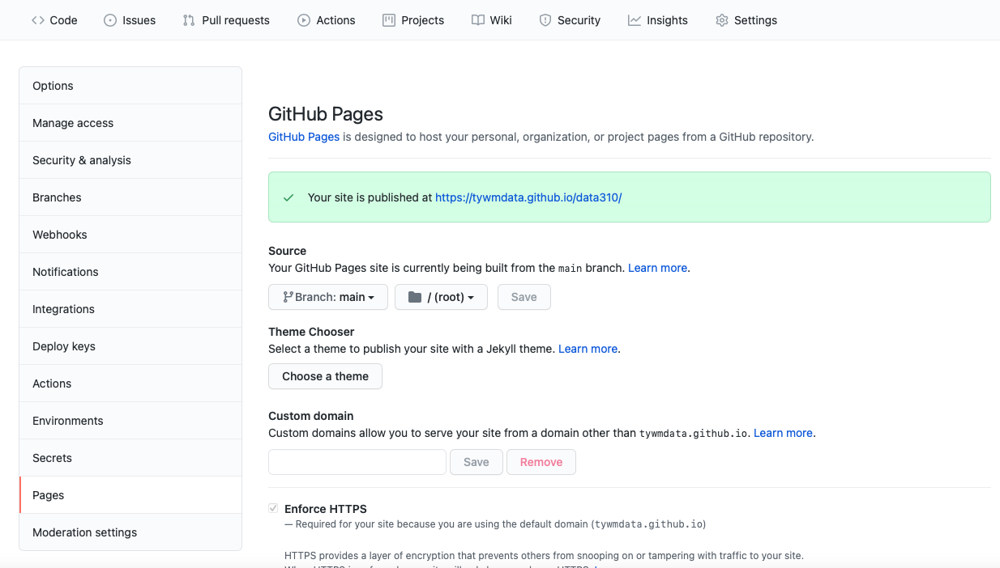

- In the main page of your repository open the *code* tab and copy the *HTTPS* address that you will use to link your repository to WebStorm via version control.  Go back to the *Welcome to Webstorm* page and select the *Get from VCS* tab.  Paste your *HTTPS* address into the URL field in order to clone your GitHub pages repository.

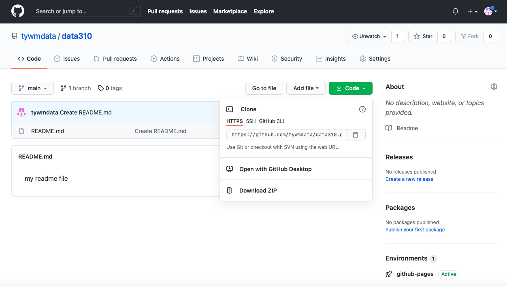

- Once you have cloned the repository from your GitHub account, you have a local project that can be modified and then those changes can be *pushed* to the GitHub repo for publishing via GitHub Pages (which happens automatically through something called the Jekyll engine).  Go ahead and modify your `README.md` file by setting it up as the index for your informal and formal assignments.  Perhaps your index looks something like the following.  Note how I created the `wwek1.md` file and linked it in the index.    

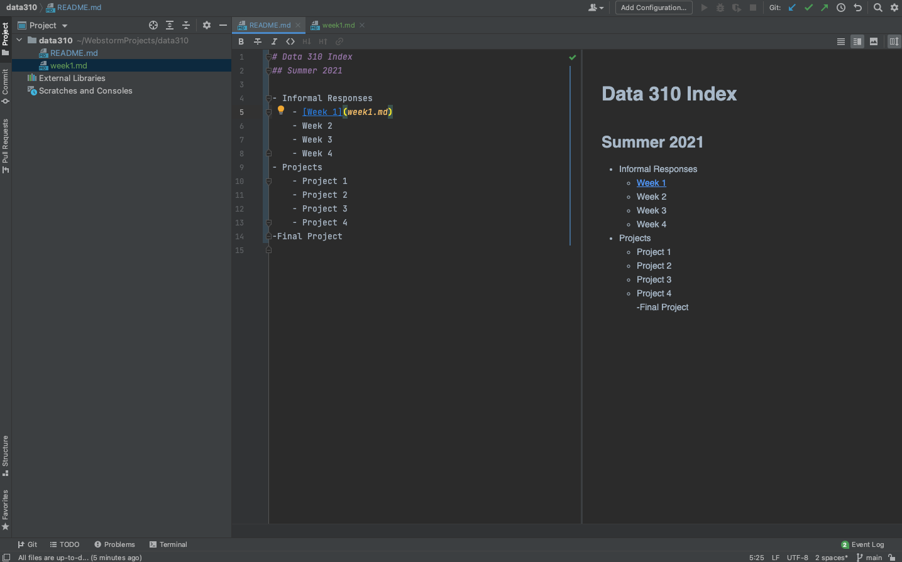  

Markdown is fairly simple to learn.  Here is a [guide](https://github.com/adam-p/markdown-here/wiki/Markdown-Cheatsheet).

Now *push* those changes to your repository by selecting the commit tab on the left hand side, highlighting all the falls you have changed to commit, add a commit message , and then select the *commit and push* tab.  You may need to add your user name, e-mail and authorize your account.  Now go back to your GitHub pages webaddress and notice that the changes have taken place.

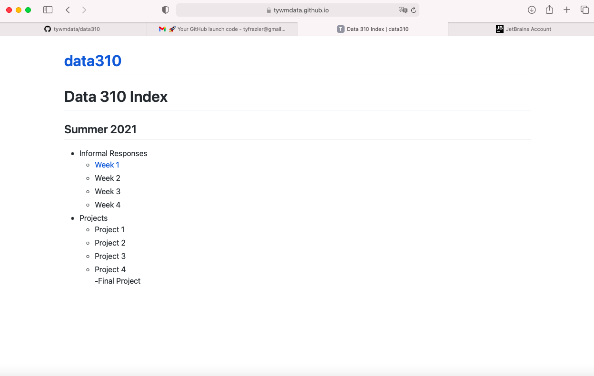  

- Finally, go back to PyCharm and create a new python script.  Go to the tensorflow webpage at [https://www.tensorflow.org/tutorials/keras/classification](https://www.tensorflow.org/tutorials/keras/classification), read and reproduce the script in PyCharm and run it.  Answer the following questions about the dataset. 
    - What is the shape of the images training set (how many and the dimension of each)?
    - What is the length of the labels training set? 
    - What is the shape of the images test set?  

Be prepared to discuss during tomorrow's class.


