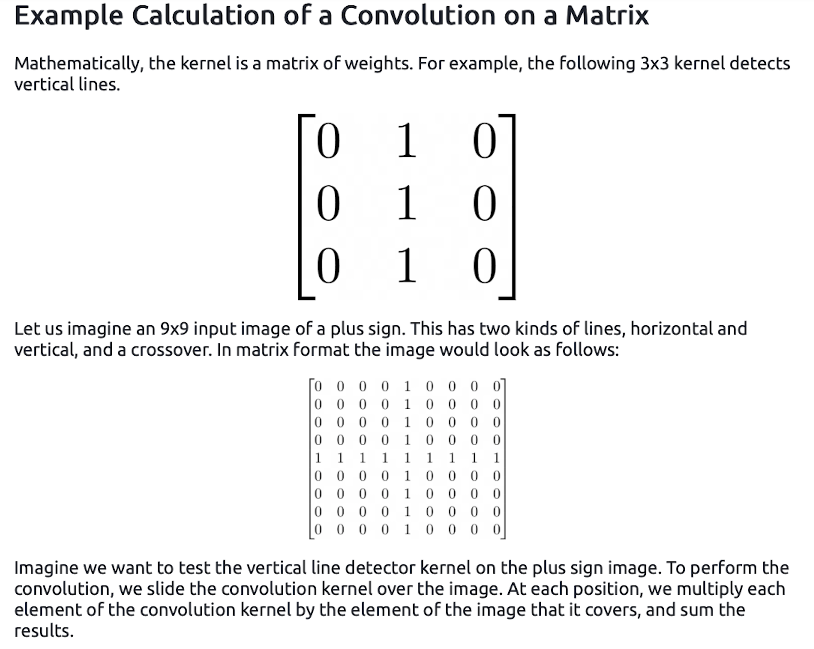
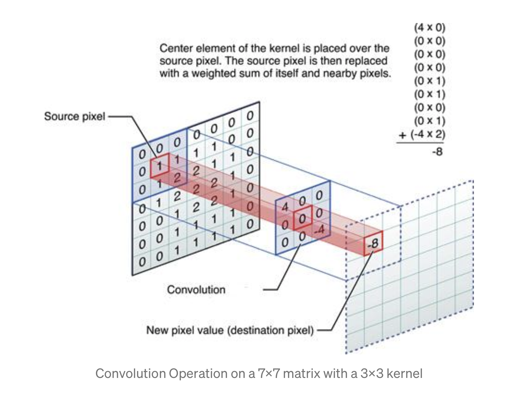

# Tuesday

Using the script you produced with the Higgs Dataset answer the following questions.

- Describe the dataset.  What type of variable is the target?  How many features are being used? How many observations are in the training dataset?  How many are used in the validation set?
- How did each of the four models perform (tiny, small, medium and large)?  Which of the four models performed the best?  Which ones performed the worst?  Why in your estimation did certain models perform better?  Produce a plot that illustrates and compares all four models.
- Apply regularization, then add a drop out layer and finally combine both regularization with a dropout layer.  Produce a plot that illustrates and compares all four models.  Why in your estimation did certain models perform better?
- What is an overfit model?  Why is it important to address it?  What are four different ways we have addressed an overfit model thus far?

For next class, we will be shifting gears back to image processing and then on to computer vision with convolutional neural networks.  Please complete the script [Load and preprocess images](https://www.tensorflow.org/tutorials/load_data/images) and then also watch the [Convolutions and pooling](https://www.youtube.com/watch?v=PCgLmzkRM38) video by Laurence Maroney of Google Developers.  After watching the video answer the following questions.
- In this exercise you manually applied a 3x3 array as a filter to an image of two people ascending an outdoor staircase.  Modify the existing filter and if needed the associated weight in order to apply your new filters to the image 3 times.  Plot each result, upload them to your response, and describe how each filter transformed the existing image as it convolved through the original array and reduced the object size.  What are you functionally accomplishing as you apply the filter to your original array?  Why is the application of a convolving filter to an image useful for computer vision?  Stretch goal: instead of using the misc.ascent() image from scipy, can you apply three filters and weights to your own selected image?  Describe your results.
- Another useful method is pooling.  Apply a 2x2 filter to one of your convolved images, and plot the result.  In effect what have you accomplished by applying this filter?  Does there seem to be a logic (i.e. maximizing, averaging or minimizing values?) associated with the pooling filter provided in the example exercise (convolutions & pooling)?  Did the resulting image increase in size or decrease?  Why would this method be useful?  Stretch goal:  again, instead of using misc.ascent(), apply the pooling filter to one of your transformed images.

Finally, review the following images from class and then convolve the 3x3 filter over the 9x9 matrix and provide the resulting matrix. [link to matrice](https://github.com/tyler-frazier/applied_machine_learning/blob/master/dailies/cnn_xtra_q.png) 

