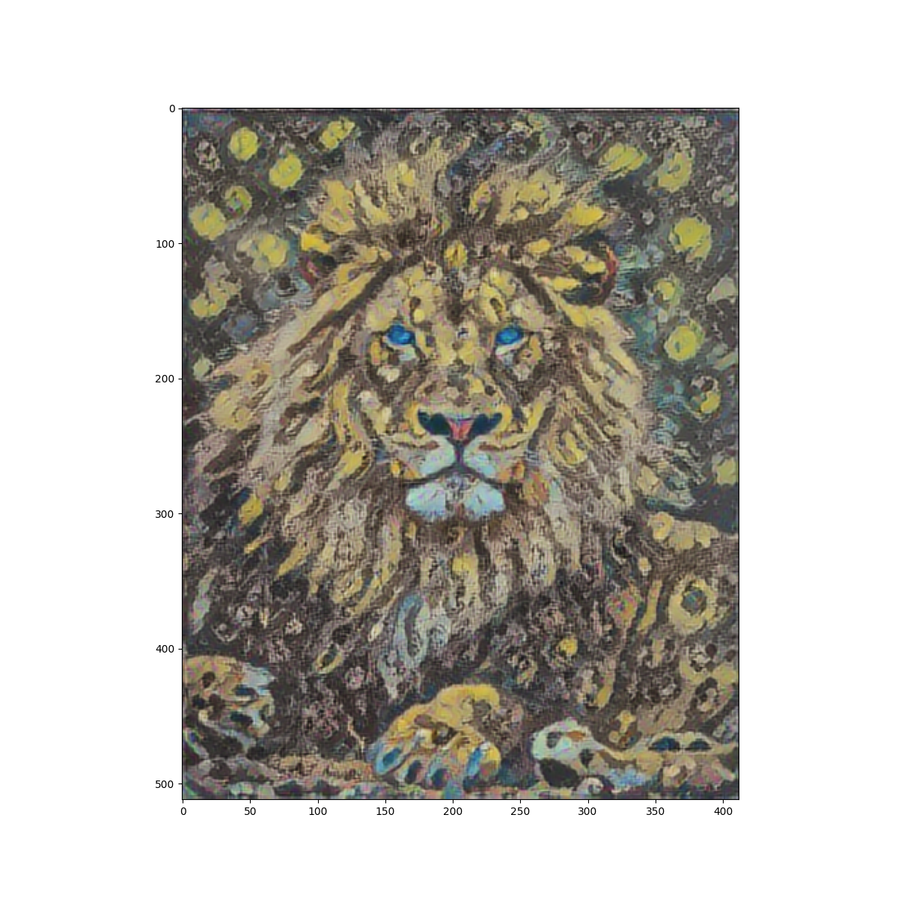

# Wednesday

Using the [Neural Style Transfer](https://www.tensorflow.org/tutorials/generative/style_transfer) script we developed during today's class replace the content and style images with two images of your own selection.  Synthesize the two images by applying the following elements from the exercise.   

- Define content and style representations
- Extracting style and content
- Implementing the style transfer algorithm
- Apply regularization term on the high frequency components

Describe your implementation of neural style transfer to your content and style images.  How did the application of the four steps from above produce your resulting work of art.  Comment on what your work means in terms of your development as a data scientist at William & Mary with forethought to the future (please feel free to take as much artistic license as you wish when answering this last question).

### Stretch goal:  Using the the [Deep Dream](https://www.tensorflow.org/tutorials/generative/deepdream) script, produce another version of your artwork.  

### For tomorrow, we will work on producing the script from the tensorflow exercise [Text generation with an RNN](https://www.tensorflow.org/text/tutorials/text_generation) during class in continued preparation for Project 4.

 